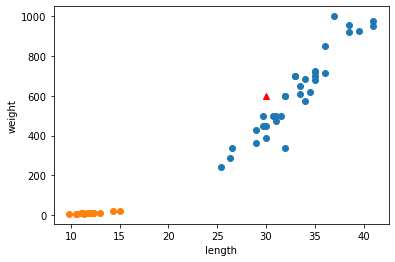

# k-최근접 이웃 알고리즘

## 목표

* 도미와 빙어를 머신러닝의 분류알고리즘을 이용하여 분류해보자.

> Scikit - learn 패키지의 **KNeighborsClassifier 분류 알고리즘**을 이용.

* 평가

## 머신러닝 - k 최근접 이웃 알고리즘을 위한 패키지


```python
#맷플롭립 패키지

import matplotlib.pyplot as plt
```


```python
#머신러닝을 위한 사이킷런 패키지 중 k-최근접 이웃 알고리즘

from sklearn.neighbors import KNeighborsClassifier
```

## 데이터 가공


```python
#도미의 길이(cm)와 무게(g) - 35마리
bream_length = [25.4, 26.3, 26.5, 29.0, 29.0, 29.7, 29.7, 30.0, 30.0, 30.7, 31.0, 31.0, 
                31.5, 32.0, 32.0, 32.0, 33.0, 33.0, 33.5, 33.5, 34.0, 34.0, 34.5, 35.0, 
                35.0, 35.0, 35.0, 36.0, 36.0, 37.0, 38.5, 38.5, 39.5, 41.0, 41.0]
bream_weight = [242.0, 290.0, 340.0, 363.0, 430.0, 450.0, 500.0, 390.0, 450.0, 500.0, 475.0, 500.0, 
                500.0, 340.0, 600.0, 600.0, 700.0, 700.0, 610.0, 650.0, 575.0, 685.0, 620.0, 680.0, 
                700.0, 725.0, 720.0, 714.0, 850.0, 1000.0, 920.0, 955.0, 925.0, 975.0, 950.0]
```


```python
#빙어의 길이(cm)와 무게(g) - 14마리
smelt_length = [9.8, 10.5, 10.6, 11.0, 11.2, 11.3, 11.8, 11.8, 12.0, 12.2, 12.4, 13.0, 14.3, 15.0]
smelt_weight = [6.7, 7.5, 7.0, 9.7, 9.8, 8.7, 10.0, 9.9, 9.8, 12.2, 13.4, 12.2, 19.7, 19.9]
```

## 데이터 상태 확인을 위한 시각화


```python
#도미와 빙어의 산점도
plt.scatter(bream_length, bream_weight)
plt.scatter(smelt_length,smelt_weight)
#도미일까? 빙어일까?
plt.scatter(30,600,marker = '^', color = 'red')
plt.xlabel('length')
plt.ylabel('weight')
plt.show()
```


    

    


## 분류 알고리즘 구현(KNeighborsClassifier)


```python
#물고기 데이터 가공
length = bream_length + smelt_length
weight = bream_weight + smelt_weight

#물고기 [길이,무게]
fish_data = [[l,w] for l,w in zip(length,weight)]

# 지도학습을 위한 target 값 만들기.(도미 =  1 빙어 = 0)
fish_target = [1] * len(bream_length) + [0] * len(smelt_length)
```


```python
#k-최근접 이웃 알고리즘 클래스 객체를 만듬.
kn= KNeighborsClassifier()

#.fit <- data와 target을 학습하는 멤버함수.
#.fit <- 성능 평가를 위한 멤버함수.
kn.fit(fish_data,fish_target)
```


    KNeighborsClassifier()


```python
print('분류하고자 하는 물고기의 길이(cm)와 무게(g)을 입력해주세요 \n')
n,m = map(int,input().split())
fish = kn.predict([[n,m]])

if fish == 1:
    print('도미 입니다!')
else:
    print('빙어 입니다!')
```

    분류하고자 하는 물고기의 길이(cm)와 무게(g)을 입력해주세요 
    
    25 150
    빙어 입니다!
    


```python
#분류 모델의 정확도
kn.score(fish_data,fish_target)
```


    1.0


* KNeighborsClassifier 알고리즘은 이웃하는 k개의 자료들을 살펴보고 다수 target값에 따라 샘플을 분류해준다!

* 객체를 만들 때 k값을 조정할 수 있다!


```python
kn49 = KNeighborsClassifier(n_neighbors = 49)
kn49.fit(fish_data,fish_target)

print(kn49.score(fish_data,fish_target))
print(35/49)
```

    0.7142857142857143
    0.7142857142857143
    

***그런데 학습한 데이터로 성능 평가하는 것이 맞는 것 일까?***

NO! 

그렇다면... ? continue
